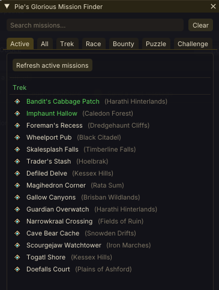
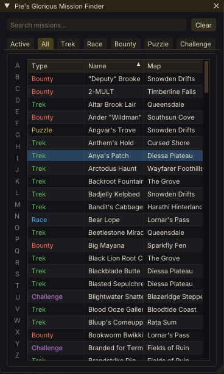

# Mission Finder (Nexus Addon)

Guild Wars 2 addon for [Raidcore Nexus](https://raidcore.gg/Nexus). Browse and search guild mission locations in-game. Click a mission to copy its waypoint info or post directly to chat.

Mission data is embedded in the DLL — no external files needed.

 

## Downloads

This repository is the home for **releases and downloads**. Grab the latest **`MissionFinder.dll`** from the [Releases](../../releases) page, or just let Nexus keep it up to date automatically.

## AI Notice

This addon has been largely created using Claude. I understand that some folks have a moral, financial or political objection to creating software using an LLM. I just wanted to make a useful tool for the GW2 community, and this was the only way I could do it.

If an LLM creating software upsets you, then perhaps this repo isn't for you. Move on, and enjoy your day.

## Features

- **Active tab** — detects which guild missions are currently active across your guilds, and which of their targets you've already completed
- **Tabs** — All, Trek, Race, Bounty, Puzzle, Challenge
- **Search** — Filter by mission name or zone (case-insensitive)
- **Click action** — Copy to clipboard or send directly to game chat
- **Quick Access** — Shortcut icon in the Nexus toolbar
- **Keybind** — Toggle with **Ctrl+Shift+G** (configurable in Nexus)

## Active Mission Detection & Game Memory

To highlight which guild missions are active this week — and which targets you've already completed — Mission Finder reads a small part of Guild Wars 2's memory. This is the **same information already shown in the in-game Guild panel**; the addon just reads it so it can point you straight to the right waypoints. It is strictly **read-only**.

**What it does**

- Reads the guild-mission state already present in the game's memory to learn which missions are active and which targets you've finished.
- Highlights those missions in the window so you can click straight to a waypoint.

**What it does NOT do**

- ❌ Never modifies, writes to, or alters the game's memory in any way.
- ❌ No code injection, function hooking, or patching of the game client.
- ❌ No automation or botting — it never moves your character, plays the game for you, or acts on a timer or in-game trigger.
- ❌ No combat, PvP, or competitive advantage of any kind.
- ❌ Never touches your account, password, or any personal data.
- ❌ The mission detection makes no network connections — your data never leaves your PC.

In short, it only *looks at* information you can already see in-game and never changes anything. This read-only approach is consistent with how other widely-used Nexus and ArcDPS addons operate under ArenaNet's third-party policy, which permits tools that do not automate, modify, or gain an advantage in the game. As with any third-party addon, use is at your own risk.

## Installation

1. Install [Raidcore Nexus](https://raidcore.gg/Nexus) if you haven't already.
2. Copy **`MissionFinder.dll`** into `Guild Wars 2/addons/`.
3. Launch the game. The addon appears in the Nexus library.

## License

Mission Finder is closed-source freeware — © 2025–2026 PieOrCake, all rights reserved. Free to download and use (streamers welcome), but no redistribution, resale, modification, or decompilation without permission. Provided as-is, with no warranty of any kind. See [LICENSE](LICENSE) for full terms.
